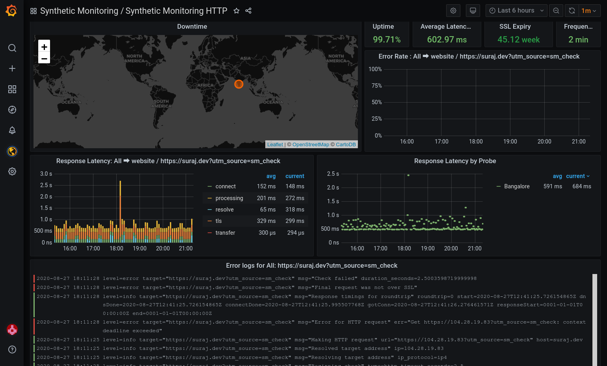
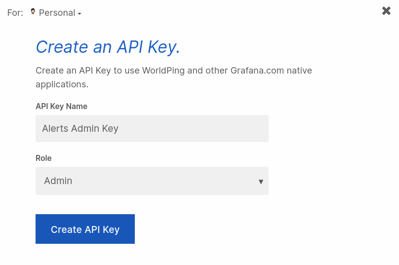
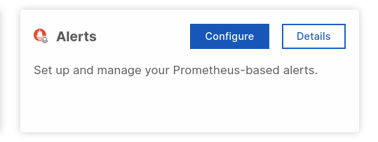
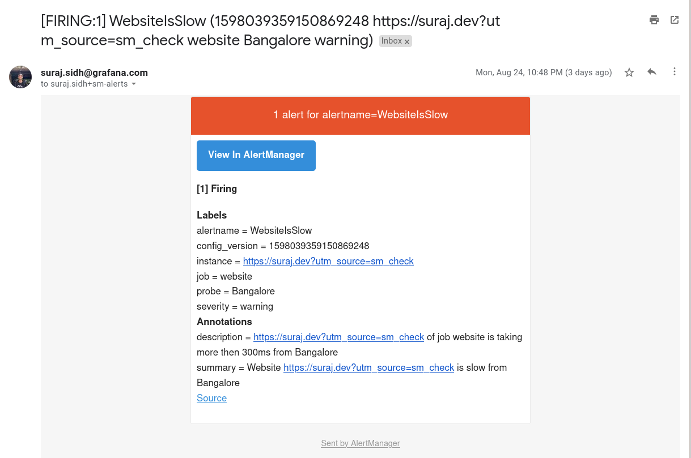

# Alerting on Synthetic Monitoring

This documents explains how to create Alertmanager alerts on Synthetic Monitoring Data.
Data from Synthetic Monitoring is in selected Metrics instance, and you can use Grafana based alerts or use Alertmanager.

These alerts are same as other Alertmanager alerts on Grafana Cloud, 
see [Alerts - Grafana Cloud Docs](https://grafana.com/docs/grafana-cloud/metrics/prometheus/alerts_rules/) to know more.

In this example, we will be creating alerts on HTTP check data.

## How to

#### Setup Synthetic Monitoring
Install Synthetic Monitoring in your Grafana Cloud Instance, 
see more on [Docs](https://grafana.com/docs/grafana-cloud/synthetic-monitoring/).

Skip to next step if it's already done

Create checks data from Synthetic Monitoring should show up in selected prom instance, 
explore the included dashboard to see the data.



#### Get cortextool
See [Alerts - Grafana Cloud Docs](https://grafana.com/docs/grafana-cloud/metrics/prometheus/alerts_rules/) 
to see how to install [cortextool](https://github.com/grafana/cortex-tools/releases)

Once it's installed, try `cortextool --help` to verify

#### Get API Key, Endpoints and User IDs

We need Grafana Cloud Admin API key, Alertmanager UserID & URL, Prometheus UserID & URL

Click details on Hosted Alerts in Grafana Cloud for UserIDs and URLs

For API key, create and use a Grafana Cloud key with `Admin` Role

Now export these, and we will use these in commands down the line





```bash
export API_KEY=<API KEY>
# Alertmanager Authentication Settings
export ALERT_URL=<ALERT_URL>
export ALERT_USER=<ALERT_USER ID>
# Metrics Authentication Settings
export PROM_URL=<PROM_URL>
export PROM_USER=<PROM_USER ID>
```

#### Configure Alertmanager
You need to Configure Alertmanager, if not already configured. by default, it's not configured.

**Load config**

- [Prometheus Docs](https://grafana.com/docs/grafana-cloud/metrics/prometheus/alerts_rules/#configure-alertmanager)

`cortextool alertmanager load alertmanager.yml --address=${ALERT_URL} --id=${ALERT_USER} --key=${API_KEY}`

**get and verify config**

`cortextool alertmanager get  --address=${ALERT_URL} --id=${ALERT_USER} --key=${API_KEY}`

- visit `<alertmanager-address>/alertmanager` to check you config

> TIP: We have blogpost on this: https://grafana.com/blog/2020/02/25/step-by-step-guide-to-setting-up-prometheus-alertmanager-with-slack-pagerduty-and-gmail/


#### Create and Upload Alert rules

Here we will alert when our website job takes more than 0.50 seconds on Bangalore probe. here is what that looks like as prom query, play around and use Grafana Explore mode to test your queries and figure out thresholds.
```
probe_duration_seconds{job="website", probe="Bangalore"} > 0.50
```

- [Prometheus Docs](https://grafana.com/docs/grafana-cloud/metrics/prometheus/alerts_rules/#configure-and-upload-alert-rules)

**load rules from prom_rules.yml**

`cortextool rules load prom_rules.yml --address=${PROM_URL} --id=${PROM_USER} --key=${API_KEY}`

**list rules**

`cortextool rules list --address=${PROM_URL} --id=${PROM_USER} --key=${API_KEY}`

**see rules**

`cortextool rules print --address=${PROM_URL} --id=${PROM_USER} --key=${API_KEY}`

**delete rules**

`cortextool rules delete <namespace> <rule group> --address=${PROM_URL} --id=${PROM_USER} --key=${API_KEY}`

You can visit `<alertmanager-address>/alertmanager/#/alerts` to see your active alerts


#### Update Alert Rules
Alert Rules can be updated by changing rules yml file and loading rules again

**Update alerts**

`cortextool rules load prom_rules.yml --address=${PROM_ADDR} --id=${PROM_ID} --key=${API_KEY}`

**See Updated Alerts**

`cortextool rules print --address=${PROM_URL} --id=${PROM_USER} --key=${API_KEY}`

#### Test Alerts
Set low thresholds to test alerts, and verify that notifications are delivered.

Example Alert email:



**Tips:**
- Use grafana explore mode to see data about how many alerts are firing.
    - `ALERTS{alertstate="firing"}` will print all firing alerts
- Use this [Grafana Dashboard](https://grafana.com/grafana/dashboards/11098) to see, and debug your Prometheus Alerts in Grafana
