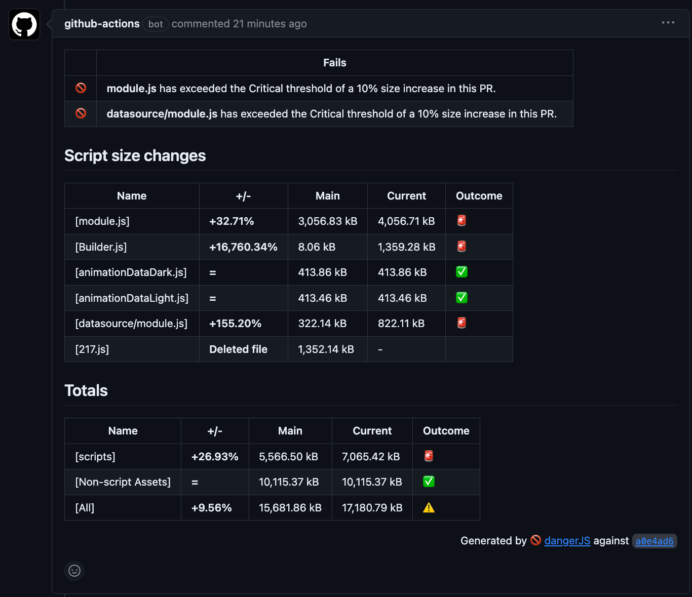

# DangerJS

_[This is taken from the GK6 repository](DangerJS-PR-comment.png)._

We use [DangerJS](https://danger.systems/js/) to automate some of the PR checks. Currently it is only used to check if the size of the plugin scripts have increased by a significant or critical amount on new pull requests compared to what is currently in `main`.

It will generate a comment on the PR with the results of the check, highlighting what modules have increased in size and by how much, as well as new and deleted scripts.

This is an example of what the comment looks like:


It can be useful to debug DangerJS locally. First, you need to export a GitHub token available in your environment for DangerJS to use so it can access the private repository:

```bash
export DANGER_GITHUB_API_TOKEN="{YOUR_TOKEN}"
```

Then you can run the DangerJS checks locally with:

```bash
yarn danger:pr {full_link_to_pr}
```

This will run the same checks that are run on the PR but log the results to your terminal instead of posting a comment on the PR.