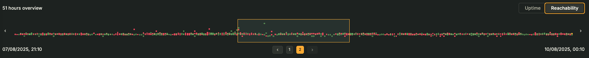

# Timepoint Explorer

The timepoint explorer is a bespoke visualisation that allows you to explore your Synthetic Monitoring data in a single place. It is primarily powered by the logs that are stored in Loki but also uses metrics to provide additional context, which are both generated by the Synthetic Monitoring agents (probes) running the checks.

The Timepoint Explorer is made up of three different components:
- The Timepoint Minimap
- The Timepoint List
- The Timepoint Viewer

They are ordered so as to display the most macro overview first, then a detailed macro view, before displaying the detailed execution logs of a single timepoint.

## Important concepts

There are some important concepts to understand when using the Timepoint Explorer:

- **A timepoint is a convenient abstraction**: A timepoint builds on the same abstraction that Grafana (and Prometheus) use for time series data, and subsquently that we use to calculate [uptime](../uptime/uptime.md).
  - A single timepoint is the same length as what the Synthetic Monitoring's frequency was for that time period. This means that a timepoint might not be uniform across the entire time range. If a check's frequency changed, then several timepoints may have different lengths.
  - Timepoints are absolutely positioned using clock alignment and are not relative to the selected time range. If you have a 15-second frequency, then the first timepoint will start at 00:00:00, the second at 00:00:15, the third at 00:00:30, and so on. The exceptions to this are when a check was created and when it was updated. The timepoint will shrink accordingly so that clock alignment is maintained.
- **Probe executions are independent**: Probes perform executions on their own schedule and they have no concept of a timepoint. The Timepoint Explorer decides what executions belong to which timepoint. An execution belongs to a timepoint based on its starting time. NOT its finished time. This means an execution might end in the following timepoint.
- **x-axis time may not be displayed in a linear fashion**: For the same reasons as above, the x-axis may not display time in a linear fashion. For example, if the Timepoint Explorer two configurations, where half the displayed timepoints have a 15-second frequency and the other half have a one-minute frequency, the second half of the x-axis represents four times the length of time as the first half.

## How it works

Because of the concepts above, it is important to note that much of the rendering of the Timepoint Explorer is anchored on what timepoints are displayed and it has much less concern for the time range that is selected.

The Timepoint Explorer has three API calls to display the **minimap** and **list** components correctly.

### Building the timepoints in the selected time range

The first API call is used to buiild a `stateless` timepoints array.

1. A request to Mimir to get the `sm_check_info` metrics for the selected time range. It extracts the `config_version` and `frequency` labels that are attached to these metrics and creates a check configs array. The `config_version` very conveniently is a nano-second timestamp of when that configuration was created so we with this information we know the duration of any single configuration, and also the duration of a timepoint during this configuration.
  - Whilst we are waiting on this API call we build a timepoint array that is based on the information we have so far: the check's creation date, its last updated date and its current frequency.

### Filling the timepoints with state

To fill the timepoints with state we need to make two more API calls:

2. A request to Mimir to get the max value for the `duration_seconds` metric for the selected time range. This is used to determine the height of y-axis so that the bars remain consistent in height and don't jump around as you use the minimap and pagination controls.

3. A request to Loki to get the **ending** logs for the selected time range. Every execution has an ending log with the `duration_seconds` label. Using this value with the log's timestamp we can determine the start time and thus which timepoint the log belongs to. Because the Synthetic Monitoring agents only send logs when they have finished an execution, there is also a `probe_success` label that we can use to determine if the execution was successful or not.

### The Timepoint Minimap

*The timepoint minimap displaying an overview of timepoints for uptime.*

*The timepoint minimap displaying an overview of timepoints for reachability. Here we can see the individual executions that make up the timepoints.*

The minimap shows a macro overview of the timepoints in the selected time range. It is used to give a quick overview of the data and to navigate to a specific section of time points. It has pagination controls because a selected time range may contain 100,000s of time points.

In the top right it shows the current time length of the displayed page.

In the top left it has a toggle to show uptime or reachability for the minimap and list views.

### The Timepoint List

*The timepoint list displaying an overview of timepoints for uptime. The tooltip for a timepoint entry is open, showing the individual executions that happened in that timepoint.*

*The timepoint list displaying an overview of timepoints for reachability. Here we can see the individual executions that make up the timepoints.*

The timepoint list displays a graph of timepoints for the selected section on the minimap. It is used to give a detailed overview of the data and to navigate to a specific timepoint by clicking on it.

Its x-axis displays the time points, ascending in time from left to right.

The y-axis displays the duration of the executions. When in uptime view mode, by default the uptime value is calculated by taking the maximum duration of the executions in the timepoint.

When in reachability view mode, each execution's duration is ploted independently.

Regardless of view mode, each timepoint entry has the same tooltip which gives a detailed breakdown of the state of the timepoint. Either by clicking on the probe name in the tooltip, or clicking the timepoint entry itself,

### The Timepoint Viewer

*The timepoint viewer displaying the execution logs for a single timepoint. The probe being viewed shows a success.*

The timepoint viewer displays the detailed execution logs for a single timepoint. It gets its state independently of the minimap and list components. Every time the timepoint viewer is given a stateless timepoint as a prop, it will make a request to Loki to get all of the logs for that timepoint.

After it has received a response from Loki, it will sort the logs (by using nanosecond precision) and then parse them. It will sort them by probe name and it will ensure that logs from the start or end of neighbouring executions are discarded. (We know an execution always starts and ends with the same `msg` labels.)

In the Timepoint Viewer there is a tabbed interface to inspect the executions of individual probes. It clearly displays whether the execution was successful or not in the tab. Within the tab content it shows the logs displayed as an event and displays the log time stamp, its level, message and unique labels. Common labels are stripped as they are just noise.

There is a toggle to show the raw logs if this additional information is desired. There are several other controls in the Timepoint Viewer:
- Previous timepoint
- Next timepoint
- View logs in Explore
- View metrics in Explore

#### On-going development

More work is planned to improve the UI and UX of the Timepoint Viewer, but this is a huge step up from viewing the raw logs in the Logs Panel.

### Timepoint Explorer States

There are various states that the Timepoint Explorer and its child components can be in.

#### Uninitialised

The Timepoint Explorer is waiting for the first API calls to be complete:

#### Failed API call(s)

The Timepoint Explorer has at least one failed API call.

#### Refetching data

The Timepoint Explorer is refetching data.

### Timepoint Explorer Annotations

The Timepoint Explorer has two types of annotations: instant annotations and range annotations. Instant annotations are a singular point in time, such as when the check was created and when it was updated.

#### Check created (instant)

Shows when the check was created.

#### Check updated (instant)

Shows when the check was updated. This annotation is derived from two sources: the `check.modified` value and also by parsing the nanosecond date returned by the `config_version` labels on the `sm_check_info` metric (see above).

Note: Because we derive the updated times from the config versions, if a situation were to occur where we have no results whatsoever for a config version prior to the most recent update (such as changing the target/instance labels) we can't create this annotation as it can't be derived from the data.

#### Alert annotations

Shows when alerts were firing aligned with the timepoints.

#### Before check was created

The Timepoint Explorer cannot render anything because the selected time range is before the check's creation date. Note that this renders differently if the check's creation date is within the selected time range (see the check creation annotation as an example). This annotation exists purely to make it clear why no data is being shown in the Timepoint Explorer.

#### No data

The selected time range has no configurations found. This is likely to be caused because the job/instance values of the check have been updated. We ID our metric data on this combination - the Timepoint Explorer can see when the check was created and can see that nothing has been returned between the selected time range and the creation date.

#### Out of selected time range

This part of the Timepoint Explorer will not render any timepoints because they are out of the selected time range.

#### Out of retention period

The selected time range includes when the logs will be out of the stack's retention period (and thus unavailable).

*Note: You can end up in a confusing situation when viewing timepoints on the edge of the retention period. As the Timepoint List makes API calls to the Loki datasource independently to the Timepoint Viewer, you may have a situation where the viewer cannot find the logs which the list component just did (as within those few seconds the timepont has crossed into 'out of the retention period').*

### Timepoint Probe States

An individual timepoint and its associated probes can have several states. A probe's state can be either:

#### 1. Success

The probe's execution returned a value of `probe_success = 1`.

#### 2. Failure

The probe's execution returned a value of `probe_success = 0`.

#### 3. Pending

The probe's execution is currently pending. This state is when no result for this probe exists for the timepoint yet and also either:

- the current time is between the timepoint's start and end date (derived by adding the timepoint's duration to its adjusted time)
- or the same for the previous timepoint

It is possible the previous probe's timepoint is still pending a result because executions belong to a timepoint where they **began**. If the execution started right at the end of the timepoint and take almost a full check frequency to complete, it is possible it is still awaiting its result.

#### 4. Missing

This is a special state that can only be derived if viewing executions which belong to the **most recent configuration**.

By cross-referencing the current check's configured probes we can see if a result exists for it or not. It is not possible to have a missing state in the Timepoint Explorer when viewing exeuctions that happened in a configuration that is not the most recent.

#### Multiple Executions

It is possible that a timepoint has multiple executions that belong to it. This isn't desirable behaviour on a whole but it can happen if the probe agents get restart or other scheduling pecularities.

### No probe results

It is possible that a timepoint has no probe results and because the check has been updated since we are unable to derive what probes it should have ran on.

