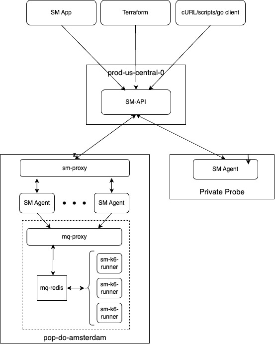
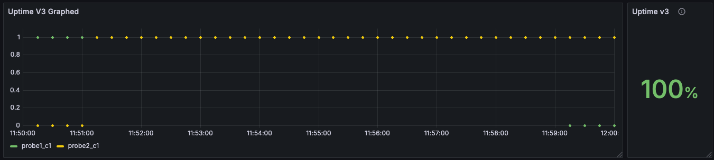
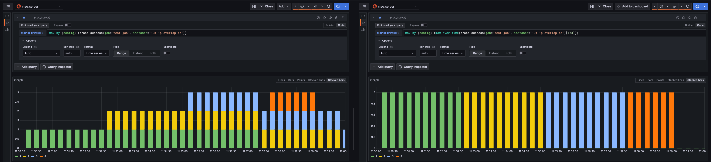

# About Uptime

"Is my website up?" is the most basic question that any website owner or operator needs to answer at any given time. During a time-sensitive incident, the answer to this question is essential for the next steps that need to be taken.

This makes it the single most important visualization that we provide in the Synthetic Monitoring application. It is crucial that it is as accurate as it can be so that users can feel confident in the data that they are seeing.

If uptime has any degree of inaccuracy, it can lead to a false sense of security or panic and frustration, which reduces confidence in our product and perceived value.

## Use cases

1. **"Is my site up right now?"** - Most daily use-cases of Synthetic Monitoring will be over smaller time ranges of a few hours. Our default is 3 hours but users might adjust the time range to 1 hour or 24 hours.
2. **"I have a fortnightly SLA to report"** - Reporting uptime metrics for weekly / bi-weekly / monthly SLAs or other business metrics at regularly occurring meetings. In this case, a moderate time period, such as a week or a month is a likely scenario.
3. **"Is our hosting provider reliable?"** - To assess whether more strategic decisions are warranted and to paint a holistic picture, it is equally valid to query much longer time periods, such as a quarter or even a year.
4. **"We had an incident. I need to know exactly what happened."** - a query of just a few minutes is very likely in the case of an incident that requires a deep level of analysis when problems began and ended so the root cause can be established.

When we consider all of these use cases, we have to cater for an accurate uptime metric for as little as a minute up to one year. This is a **huge** range of time periods and we need to be able to accurately calculate uptime for all of them.

## A naive calculation

We calculate uptime as the percentage of successful time points in the requested time range that return a positive result. A simple way to express uptime is as follows:

```
Uptime = (Successful Time Points / Total Time Points) * 100
```

A time point is a collection of probes executing the same check at the same time. If a single probe returns a positive result, the time point is considered successful. If all probes return a negative result, the time point is considered a failure.

Example calculation:
| Time | Probe1 | Probe2 | Probe3 | Uptime Result     |
|------|--------|--------|--------|-------------------|
| t1   | 1      | 1      | 1      | Success           |
| t2   | 0      | 0      | 0      | Failure           |
| t3   | 1      | 0      | 0      | Success           |
| t4   | 1      | 1      | 0      | Success           |

Uptime = (3 successful time points / 4 total time points) * 100 = 75%

## Understanding the underlying complexity

The above calculation is a naive way to calculate uptime and doesn't take into account the nuance and multi-layered architecture of how we run checks and store data. The two big variables that we need to consider are:

1. When does a time point start and end? How many probes reported a result for that time point?
    - In an ideal world, if you had a probe running a check every 15 seconds they would each report their results at precisely the interval time. e.g. 12:00:15, 12:00:30, 12:00:45. However, in reality, probes won't always report their results at the same time. One probe might report at 12:00:15 but the second probe might report at 12:00:16. It could be as late as 12:00:29 or even 12:00:30, which would now be considered a new time point. Time point 1 would only have two probe execution results and time point 2 would have three (or possibly four...) probe execution results.
2. How large is the time period we are querying and how often is the check executing? Consider the following tables in how extreme the execution number can vary depending on the time period, check frequency and number of probes.

| Time range | Check frequency | Number of probes | Executions  |
|------------|-----------------|------------------|-------------|
| 1 hour     | 1 minute        | 1                | 60          |
| 1 day      | 1 minute        | 1                | 1,440       |
| 1 week     | 1 minute        | 1                | 10,080      |
| 1 year     | 1 minute        | 1                | 524,160     |

| Time range | Check frequency | Number of probes | Executions  |
|------------|-----------------|------------------|-------------|
| 1 hour     | 1 minute        | 3                | 180         |
| 1 day      | 1 minute        | 3                | 4,320       |
| 1 week     | 1 minute        | 3                | 30,240      |
| 1 year     | 1 minute        | 3                | 1,572,480   |

| Time range | Check frequency | Number of probes | Executions  |
|------------|-----------------|------------------|-------------|
| 1 hour     | 15 seconds      | 20               | 4800        |
| 1 day      | 15 seconds      | 20               | 115,200     |
| 1 week     | 15 seconds      | 20               | 806,400     |
| 1 year     | 15 seconds      | 20               | 41,932,800  |

3. A check might have multiple configurations during the time period we are querying. This could be a change in frequency, the number of probes or the check's definition of uptime itself. This could lead to a change in the number of time points and the number of them which are successful.

4. It is not guaranteed that every check's results will end up in Mimir. The agent uses the HTTP remote write method and that is subject to the fickleness of the internet so some samples may be unintenionally dropped and go unreported. This is a comparatively small number but it is worth noting and will have a more magnifying effect at smaller time ranges.

## A consideration for visualising uptime

When we visualize uptime, we need to consider how we present the data to the user. We have two main ways of visualizing uptime:

1. **Single stat panel**: It is a single number that represents the uptime percentage for the given time range. It is the most straightforward way to present the data but it doesn't give the user any insight into how that number was derived.

2. **Graph**: It shows the underlying data that contributes to calculating the uptime percentage and correlates with the mental model of how Synthetic Monitoring operates: a plot point = a Synthetic Monitoring check.

It is more complex to understand but gives the user a more in-depth view of how their endpoints were performing at any given time.


## How we collect and query data



[A more detailed explanation of the Synthetic Monitoring architecture in our on-call training. (Grafana Labs internal-only)](https://docs.google.com/presentation/d/1jWuv2VwVFIsdyXq4JQMlhmM6txHXLyHImYpnl50V5XQ/edit#slide=id.g308ff111cb5_0_35).

Our architecture is multi-layered with many separate services. Please read the material above for an in-depth guide to how we collect and publish data. The most relevant part when considering uptime is: **we have multiple probes (which are effectively SM Agents) that run checks at regular intervals and report metric results to a Grafana Cloud Mimir instance and log results to a Grafana Cloud Loki instance.**

Our agents report two time series metrics which are directly related to uptime:
1. `probe_success` is a [Prometheus gauge metric](https://prometheus.io/docs/concepts/metric_types/#gauge). It can only have a value of 0 or 1. 0 represents an execution failure and 1 represents an execution success.
2. `probe_all_success` is a [Prometheus summary metric](https://prometheus.io/docs/concepts/metric_types/#summary). A summary metric is made up two separate observations, in this case:
    - `probe_all_success_sum`: the sum of all __successful__ executions
    - `probe_all_success_count`: the count of all executions

Within the Synthetic Monitoring App we query the instance's default Cloud Mimir datasource using PromQL to calculate uptime.

## How could we calculate uptime?

There are two approaches we could take to calculating uptime:
1. 


## How we calculate uptime with PromQL

Taking into account all of the above, our uptime calculation is the following:

```
max by () (max_over_time(probe_success{job="$job", instance="$instance"}[$frequencyInSeconds]))
```

With the additional options:

```
maxDataPoints: 8000
minInterval: $frequencyInSeconds
```

To explain the individual parts of the query, starting from the innermost part:

### probe_success{job="$job", instance="$instance"}

`probe_success` is a [Prometheus gauge metric](https://prometheus.io/docs/concepts/metric_types/#gauge) reported by each of our probes. It can only have a value of 0 or 1. 0 represents a failure and 1 represents a success. We add `job` and `instance` label filters as these two combined are how we uniquely identify a check. `probe` and `config_version` labels are also available on this metric but are not explicitly used in the uptime calculation. It is worth noting they exist on the metric because if we modify the base query we can end up with very different results depending on the scenario _[See the example below](#what-happens-if-we-remove-the-max_over_time-aggregation-from-the-query)_.

### max_over_time({{_metric_}}[$frequencyInSeconds])

`max_over_time` is a [Prometheus aggregation function](https://prometheus.io/docs/prometheus/latest/querying/functions/#aggregation_over_time) that returns the maximum value of a metric over a given time range, in this case a check's frequency in seconds: `$frequencyInSeconds`.

We use (`$frequencyInSeconds`) to determine what the 'look back' time should be (which gives us a 'time point'). For example, if the check is running every 15 seconds, the step would be 15 seconds. If the check is running every minute, the step would be 60 seconds.

This function gives us two benefits in particular, one explicit and one implicit:

1. __explicit__: we are telling Prometheus what the 'look-back' value is and what we consider a time point. Essentially, 'evaluate the entire time range in blocks of $frequencyInSeconds' and return the max value (e.g. 1 if it is successful) for each block. This allows groups of probes to report their results at any point during the time point and be considered a single point in time.
2. __implicit__: this turns off Prometheus' assumed continuity of metrics. If we didn't use this function, Prometheus would assume that the metric is continuous and that there are no gaps in the data. This is not the case and often acts as a horrible assumption creating inaccurate results. _[See the example below](#what-happens-if-we-remove-the-max_over_time-aggregation-from-the-query)_

## sum(...)

Because of the `probe` label, we can have multiple results for a single time point. We sum all of the results for all probes given a time point to get a single result.

## max by() (...)

Each assessment of uptime in a time point is a binary result: it is either 1 (success) or 0 (failure). In the previous step we sum all of the probe results for a given time point and in this step we 'clamp' the result to a maximum of 1. We only care if a time point is successful or not. If a time point has 3 successful probes, we still only want to count it as 1 successful time point (individual successes are represented by our reachability metric).

## Testing strategy

We have a library where we can create a base set of Prometheus metrics across different common scenarios. This allows us to test our PromQL queries where we know precisely what the expected result should be as we have access to the underlying data to confirm without using PromQL to extract it (_a snake eating its own tail comes to mind..._). We can then modify the base query to see how it behaves in different scenarios and across different time periods and evaluate the results.

There are two base-level assumptions each of the following scenarios has been run through:

1. **The control group (in-phase)**: Every probe reports its result at exactly the check interval time (e.g. 12:00:15, 12:00:30, 12:00:45)
    - This is to simulate the ideal scenario where probes report their results at the same time and where we 'know' what the expected result should be to compare against.
2. **The real-world group (out-of-phase)**: Every entry has a 1% chance to 'blip' and delay its reporting by up to 33% of the check's frequency time, which knocks onto the following time point.
    - This is to _somewhat_ simulate the real-world scenario where probes don't report their results at the same time. It makes evaluation of what the expected result should be more difficult but using the control group as a comparison we can see how the query behaves in a more realistic scenario.

There are four time periods that we have tested our uptime query against:

1. __10 minutes__ / 15-second frequency
2. __3 hours__ / 15-second frequency
3. __6 months__ / 1-minute frequency
4. __1 year__ / 1-minute frequency

Against each of these time periods we have tested the following scenarios:

### Testing scenarios

_The following examples are all taken from the control group, showing 'in-phase' results over a 10-minute time period._

#### 1p_overlap


Our simplest scenario: a single probe with 10% of failures at the end of the time period. The query correctly calculates 90% uptime.

#### 1p_random


A single probe with 10% of failures randomly distributed throughout the time period. The query correctly calculates 90% uptime.

#### 1p_overlap_4c


A single probe with 10% of failures at the end of the time period, the probe had 4 config_versions of equal length during the time period but all failures occurred in the last config_version. The query correctly calculates 90% uptime.

#### 2p_overlap


Two probes with a 10% failure rate at the end of the time period. The query correctly calculates 90% uptime.

#### 2p_no_overlap


Two probes each with a 10% failure rate. probe1 has its failures at the end of the time period, probe2 has its failures at the beginning so they never overlap. The query correctly calculates 100% uptime.

#### 2p_random


Two probes each with a 10% failure rate. Each probe has its own random failures throughout the time period which may or may not overlap. In the example above, none of the failures overlap so the query correctly calculates 100% uptime.

#### 2p_shared_random


Two probes with a 10% failure rate. The failures are shared at random points of time for each probe. The query correctly calculates 90% uptime.

#### 20p_random


20 probes with a 50% failure rate. Each probe has its own random failures throughout the time period. In the example above, none of the failures overlap so the query correctly calculates 100% uptime (it is possible but very unlikely for all 20 probes to fail at the same time point when the failures for each probe are random).

#### 20p_shared_random


20 probes with a 50% failure rate. The failures are shared at random points of time for each probe. The query correctly calculates 50% uptime.

`shared_random` is to simulate the scenario where the issue lies at the endpoint on the client's side; `random` is to simulate the scenario where the issue lies with the probe itself.

### Results

Every scenario has been evaluated three times to ensure the randomness of the entry data has been taken into account. The three results are then averaged to give a final result of accuracy.

This means the uptime query has been assessed **240** times in total: 2 base assumptions * 4 time ranges * 10 scenarios * 3 randomness offset. Collectively these tests generated over 1 billion metrics.

#### Accuracy in the control group.

| Scenario          | 10m    | 3h     | 6M     | 1y     |
|-------------------|--------|--------|--------| ------ |
| 1p_overlap        | 100%   | 100%   | 100%   | 100%   |
| 1p_random         | 100%   | 100%   | 99.83% | 99.85% |
| 1p_overlap_4c     | 100%   | 100%   | 100%   | 100%   |
| 2p_overlap        | 100%   | 100%   | 100%   | 100%   |
| 2p_no_overlap     | 100%   | 100%   | 100%   | 100%   |
| 2p_overlap_4c     | 100%   | 100%   | 100%   | 100%   |
| 2p_random         | 99.9%  | 99.48% | 99.67% | 99.77% |
| 2p_shared_random  | 100%   | 100%   | 99.7%  | 99.6%  |
| 20p_random        | 100%   | 100%   | 100%   | 99.96% |
| 20p_shared_random | 100%   | 100%   | 99.42% | 99.34% |

#### 'Accuracy' in the blip group.

_This is a more difficult metric to measure and interpret as the expected result is not precisely known but from extrapolation of the control group, and what we know a blip is likely to do we can see how the query behaves with more realistic real-life data._

| Scenario          | 10m     | 3h      | 6M      | 1y      |
|-------------------|---------|---------|---------| ------- |
| 1p_overlap        | ~100%   | ~99.96% | ~99.96% | ~99.99% |
| 1p_random         | ~99.91% | ~99.99% | ~99.63% | ~99.87% |
| 1p_overlap_4c     | ~99.14% | ~99.99% | ~99.99% | ~99.99% |
| 2p_overlap        | ~99.16% | ~99.95% | ~99.99  | ~100%   |
| 2p_no_overlap     | ~100%   | ~99.95% | ~99.98% | ~99.99% |
| 2p_overlap_4c     | ~100%   | ~99.95% | ~100%   | ~99.99% |
| 2p_random         | ~99.16% | ~99.03% | ~98.65% | ~98.66% |
| 2p_shared_random  | ~100%   | ~97.13% | ~91.7%  | ~91.99% |
| 20p_random        | ~100%   | ~91.62% | ~100%   | ~100%   |
| 20p_shared_random | ~99%    | ~99%    | ~100%   | ~100%   |

#### Explaining the results:

In the control group, if we inspect the underlying data for the 20_shared_random results with a 50% failure rate, we can see when the failures occur. Every time point has all 20 probes either successfully passing or failing.


__In phase probes__. A graph showing 40 time points, 20 of which are successful and 20 of which are failures. The failures are all at the same time point.

When reduced in the stat panel, this shows a 50% uptime.


__Out of phase probes__. A graph showing 40 time points, 30 of which have a successful result and 10 of which are failures. This is the more 'realistic' scenario with real world reporting because of the interaction between how agents start/restart and also how agents communicate with k6-runners for k6-powered checks. It is very likely for the probes to begin running the checks at different times ('out-of-phase') and increasingly become out of sync. Frankly, this is a feature rather than a bug as it ensures monitoring coverage is more comprehensive and a client's endpoints aren't receiving a barrage of requests at exactly the same time.

When reduced in the stat panel, this shows a 75% uptime -- which from the point of view of measuring uptime is correct. Across the 40 time points, 30 are successful and 10 are failures despite the heavy-skewing of certain time points reporting multiple successes versus some only reporting one or two successes. Because our testing strategy deliberately introduces this random aspect to it, it is impossible to accurately predict what the expected result should be (without evaluating the data in minute detail) but we are confident that the query is behaving as expected.

##### How is the uptime query over a year period so accurate?


Uptime v3 showing 49.7% uptime for the `20p_shared_random` scenario. The underlying data has a 50% uptime so the result is only off by 0.3%, which is very impressive for a single query quickly evaluating 10,500,000 individual data points (525,000 minutes in a year x 20 probe results).

Honestly, no idea - Prometheus Black magic is the only answer I can provide. I have gone over the whole testing process from start to finish with a fine tooth comb to understand if there is any fault in the underlying data that is generated, the backfill process and uploading to Prometheus but it is all correct.


The above image demonstrates visualizing a 10-minute period that is approximately 11 months into the past of the dataset and cross-referencing the raw data that was generated that is inserted into Prometheus. Uptime v3 is precisely correct in its calculation, Uptime calculations V1 and V2 are both _wildly_ incorrect.

11 data points: 3 successes, 8 failures. (3/11 * 100) = 27.3% uptime (rounded).

##### Can I view the raw results that were used in the testing process?

Yes. They are saved in our 'Synthetics Dashboards reference' Google Sheet in the tabs ['In-phase Testing scenarios'](https://docs.google.com/spreadsheets/d/1-Rc2vti-LoKqM9Z-GureUXKwmbc1AJ1B8GvHx5pJrDA/edit?gid=192150256#gid=192150256) and ['Out-of-phase Testing scenarios'](https://docs.google.com/spreadsheets/d/1-Rc2vti-LoKqM9Z-GureUXKwmbc1AJ1B8GvHx5pJrDA/edit?gid=843281165#gid=843281165).

## FAQ

### Why do we use range queries instead of instant queries for generating a single uptime metric?

Because we have the ability to transform the data on the client side within our Grafana plugin, we are able to use the more powerful and fully featured range queries that Prometheus provides. Despite we often show uptime as a reduced single stat panel, having the ability to show the underlying data in a graph how that single stat is derived is very powerful and helps users visualize it in a more meaningful way.

A limitation we bypass using range queries is Mimir's 768-hour (32 days) time range limit for instant queries, meaning we can support more of the long-range use cases outlined at the top of this document.

### Why don't we use the `probe_all_success` summary metrics?

We use these metrics for alerting currently (subject to being reviewed in-depth). Previously we had been using this metric with the `increase` function to calculate uptime. Compare the results when utilizing our original V1 calculation to our V3 calculation in our simplest scenario, `1p_overlap` over 10 minutes:


The v1 query (bottom) shows both an incorrect single stat (94.9%) and a graph that shows a gradual increase in uptime at the beginning of the time period and a gradual decline at the end. Neither of these are correct and are a misleading interpretation of the underlying data. It is impossible to have a gradual slope in uptime: it is either a successful time point or it is not.

### What happens if we remove the `max_over_time` aggregation from the query?

Prometheus has a feature where it has 'assumed continuity' of metrics. This means that if a metric is not reported for a given time point, Prometheus will assume that the metric is the same as the previous time point for the next five minutes before it stops reporting. For Synthetic Monitoring, this is a terrible assumption to make and can have a detrimental effect on the accuracy of our uptime calculation.

The most likely scenario for a metric to stop reporting results is when a check's configuration has been altered. This could be a change in frequency, the number of probes or the check's definition of uptime itself. The `config_version` changes to a nanosecond unix timestamp when the check's configuration changes and is the most likely time that uptime would be affected (i.e. accidentally introducing a flaw in their uptime definition).



In the example above, on the left is the query `(clamp_max(probe_success{job="$job", instance="$instance"}, 1))` versus `(clamp_max(max_over_time(probe_success{job="$job", instance="$instance"}[$frequencyInSeconds]), 1))` on the right. We can see every time point is considered successful in the left graph because of the assumed continuity of metrics and how `probe_success` results now overlap, even though it is impossible in our architecture. Turning off continuity of metrics is a must for our uptime calculation.

### Do we take into account a change of frequency across the selected time period in our uptime calculation?

No. This is currently a problem that we need to do a more thorough investigation into how to solve.
